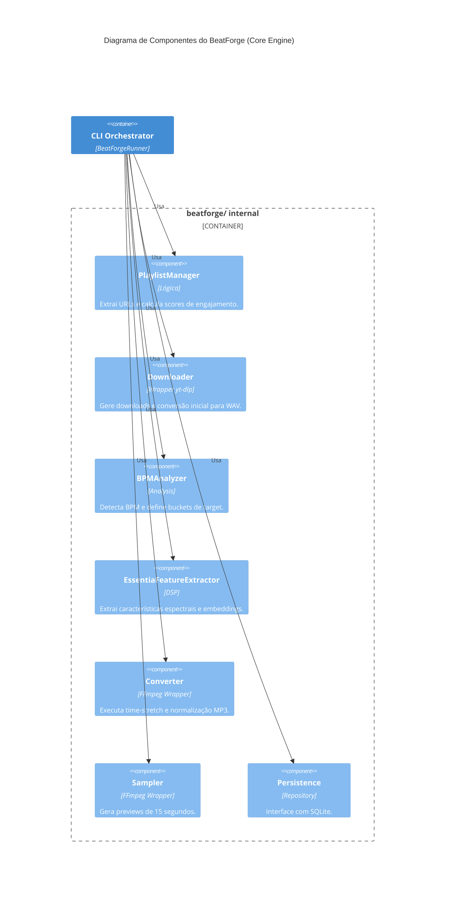

# C4 Nível 3: Componentes — BFX (Core Engine)

```mermaid
C4Component
    title Diagrama de Componentes do BeatForge (Core Engine)

    Container(cli, "CLI Orchestrator", "BeatForgeRunner")

    Container_Boundary(core_boundary, "beatforge/ internal") {
        Component(playlist_mgr, "PlaylistManager", "Lógica", "Extrai URLs e calcula scores de engajamento.")
        Component(downloader, "Downloader", "Wrapper yt-dlp", "Gere downloads e conversão inicial para WAV.")
        Component(bpm_analyzer, "BPMAnalyzer", "Analysis", "Detecta BPM e define buckets de target.")
        Component(feature_extractor, "EssentiaFeatureExtractor", "DSP", "Extrai características espectrais e embeddings.")
        Component(converter, "Converter", "FFmpeg Wrapper", "Executa time-stretch e normalização MP3.")
        Component(sampler, "Sampler", "FFmpeg Wrapper", "Gera previews de 15 segundos.")
        Component(persistence, "Persistence", "Repository", "Interface com SQLite.")
    }

    Rel(cli, playlist_mgr, "Usa")
    Rel(cli, downloader, "Usa")
    Rel(cli, bpm_analyzer, "Usa")
    Rel(cli, feature_extractor, "Usa")
    Rel(cli, converter, "Usa")
    Rel(cli, sampler, "Usa")
    Rel(cli, persistence, "Usa")
```
