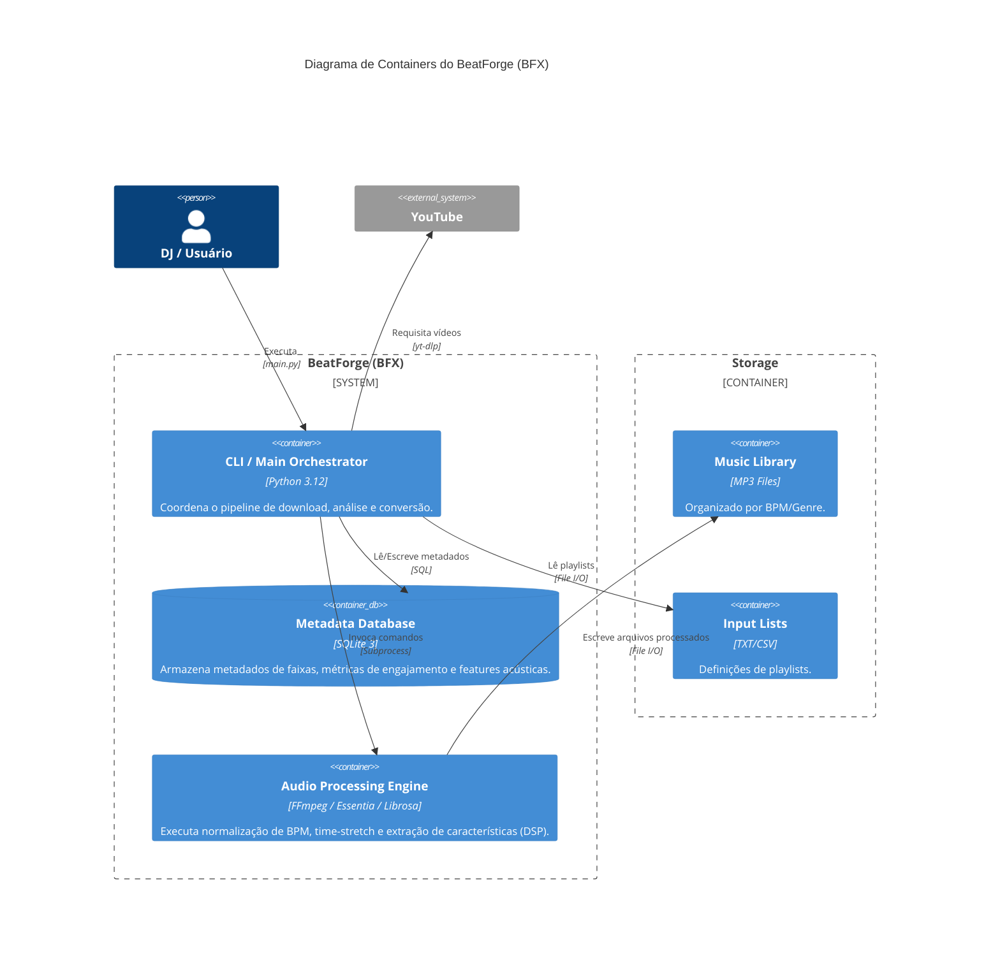

# C4 Nível 2: Containers — BFX

```mermaid
C4Container
    title Diagrama de Containers do BeatForge (BFX)

    Person(dj, "DJ / Usuário")

    System_Boundary(bfx_boundary, "BeatForge (BFX)") {
        Container(cli, "CLI / Main Orchestrator", "Python 3.12", "Coordena o pipeline de download, análise e conversão.")
        ContainerDb(sqlite, "Metadata Database", "SQLite 3", "Armazena metadados de faixas, métricas de engajamento e features acústicas.")
        Container(worker, "Audio Processing Engine", "FFmpeg / Essentia / Librosa", "Executa normalização de BPM, time-stretch e extração de características (DSP).")
    }

    System_Ext(youtube, "YouTube")
    Container_Boundary(fs_boundary, "Storage") {
        Container(music_fs, "Music Library", "MP3 Files", "Organizado por BPM/Genre.")
        Container(config_fs, "Input Lists", "TXT/CSV", "Definições de playlists.")
    }

    Rel(dj, cli, "Executa", "main.py")
    Rel(cli, sqlite, "Lê/Escreve metadados", "SQL")
    Rel(cli, youtube, "Requisita vídeos", "yt-dlp")
    Rel(cli, worker, "Invoca comandos", "Subprocess")
    Rel(worker, music_fs, "Escreve arquivos processados", "File I/O")
    Rel(cli, config_fs, "Lê playlists", "File I/O")
```
