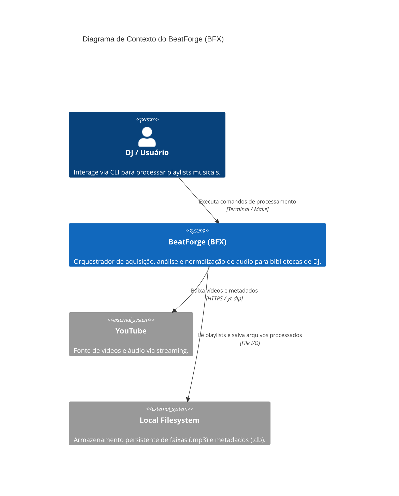

# C4 Nível 1: Contexto do Sistema — BFX

```mermaid
C4Context
    title Diagrama de Contexto do BeatForge (BFX)
    
    Person(dj, "DJ / Usuário", "Interage via CLI para processar playlists musicais.")
    
    System(bfx, "BeatForge (BFX)", "Orquestrador de aquisição, análise e normalização de áudio para bibliotecas de DJ.")
    
    System_Ext(youtube, "YouTube", "Fonte de vídeos e áudio via streaming.")
    System_Ext(filesystem, "Local Filesystem", "Armazenamento persistente de faixas (.mp3) e metadados (.db).")

    Rel(dj, bfx, "Executa comandos de processamento", "Terminal / Make")
    Rel(bfx, youtube, "Baixa vídeos e metadados", "HTTPS / yt-dlp")
    Rel(bfx, filesystem, "Lê playlists e salva arquivos processados", "File I/O")
```
