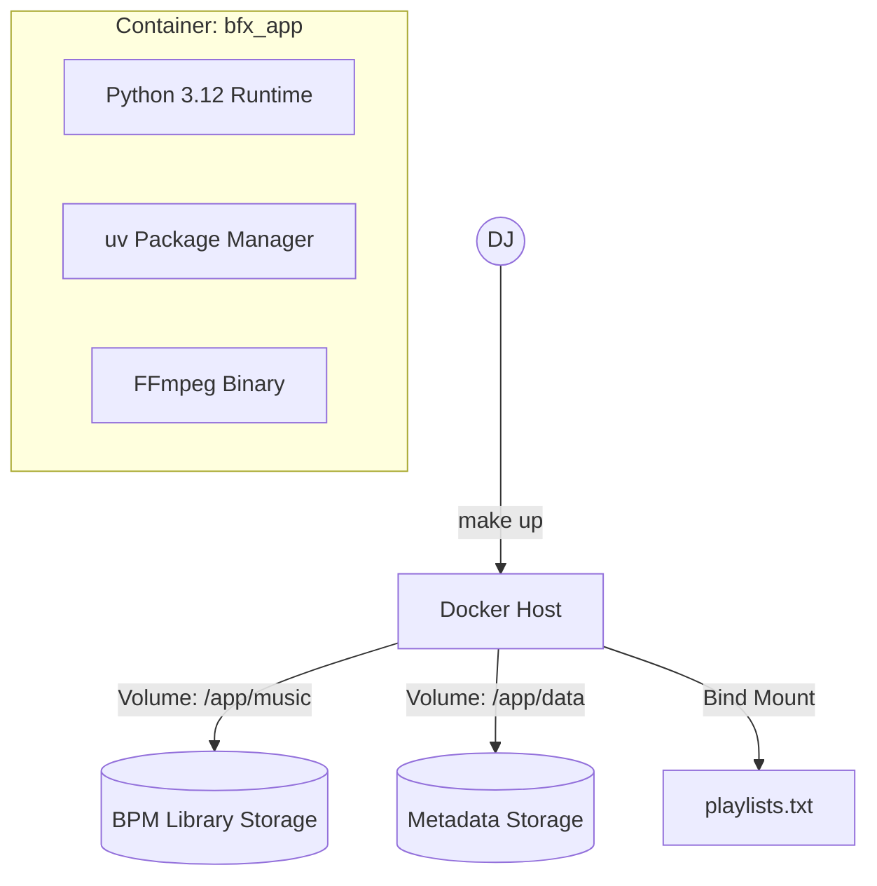

# Arquitetura de Deployment e Infraestrutura — BFX

> Gerado pelo Architect em 2026-04-30
> Nível de Documentação: **Detalhado**

## 📦 Modelo de Containerização

O sistema é empacotado como uma imagem Docker única baseada em Python Slim, otimizada para execução em ambientes Linux (especificamente Ubuntu/Debian conforme identificado no histórico de commits).

## 🛠️ Stack de Infraestrutura
- **Base Image:** `python:3.12-slim`
- **Package Manager:** `uv` (para instalações determinísticas e rápidas)
- **Audio Processing:** FFmpeg (instalado via `apt-get` na imagem)
- **Runtime Configuration:** Injeção de dependência via variáveis de ambiente (`OUTPUT_DIR`, `DATABASE_PATH`).

## 💾 Persistência de Dados
- **Volumes Docker:**
    - `bfx_music_storage`: Persiste os arquivos MP3 finais, organizados por BPM.
    - `bfx_metadata_storage`: Persiste o arquivo `playlist.db` (SQLite).
- **Recursos (Deploy Limits):**
    - CPU: 2.0 (limite)
    - Memória: 4G (limite) — Necessário devido ao processamento intensivo de features com Essentia/TensorFlow.

## ⚠️ Dívidas Técnicas Arquiteturais
1. **Desnormalização Extrema:** O banco de dados utiliza uma única tabela para metadados, features acústicas e embeddings. Embora simplifique a persistência, dificulta a manutenção e evolução do esquema (visto nas migrações manuais em `persistence.py`).
2. **IO Bound Blocking:** O pipeline de download e conversão é síncrono. Um único download lento bloqueia todo o processamento subsequente de outras playlists.
3. **Dependência de Binários Locais:** O sistema assume a presença de `ffmpeg` no PATH, o que é garantido no Docker, mas gera inconsistências em ambientes locais sem a configuração correta.
