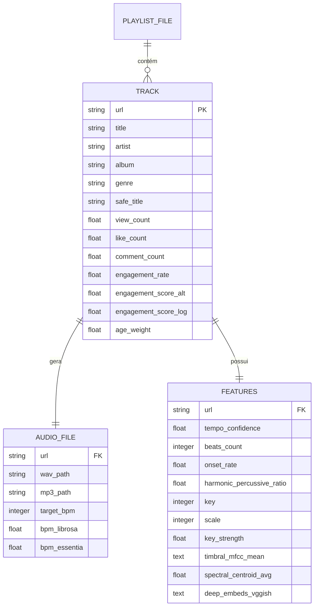

# Diagrama Entidade-Relacionamento (ERD) — BFX

> **Nota:** No banco SQLite atual (`playlist.db`), estas entidades estão desnormalizadas na tabela única `track_info`. O diagrama acima representa o modelo lógico implícito.
