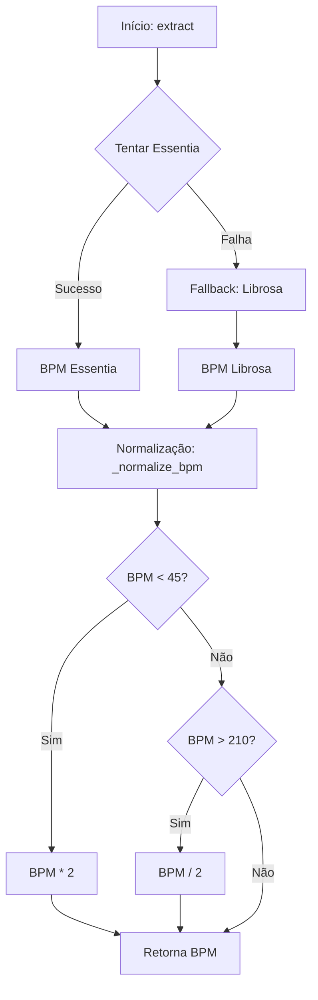

# Fluxograma: BPM Analyzer

```mermaid
graph TD
    A[Início: extract] --> B{Tentar Essentia}
    B -- Sucesso --> C[BPM Essentia]
    B -- Falha --> D[Fallback: Librosa]
    D --> E[BPM Librosa]
    C --> F[Normalização: _normalize_bpm]
    E --> F
    F --> G{BPM < 45?}
    G -- Sim --> H[BPM * 2]
    G -- Não --> I{BPM > 210?}
    I -- Sim --> J[BPM / 2]
    I -- Não --> K[Retorna BPM]
    H --> K
    J --> K
```
