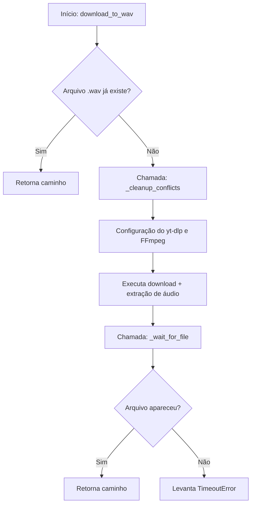

# Fluxograma: Downloader

```mermaid
graph TD
    A[Início: download_to_wav] --> B{Arquivo .wav já existe?}
    B -- Sim --> C[Retorna caminho]
    B -- Não --> D[Chamada: _cleanup_conflicts]
    D --> E[Configuração do yt-dlp e FFmpeg]
    E --> F[Executa download + extração de áudio]
    F --> G[Chamada: _wait_for_file]
    G --> H{Arquivo apareceu?}
    H -- Sim --> I[Retorna caminho]
    H -- Não --> J[Levanta TimeoutError]
```
