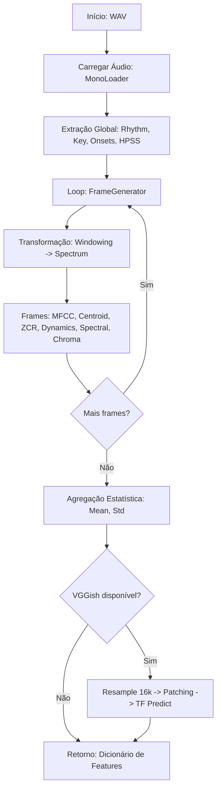

# Fluxograma: EssentiaFeatureExtractor - extract_all

```mermaid
graph TD
    A[Início: WAV] --> B[Carregar Áudio: MonoLoader]
    B --> C[Extração Global: Rhythm, Key, Onsets, HPSS]
    C --> D[Loop: FrameGenerator]
    D --> E[Transformação: Windowing -> Spectrum]
    E --> F[Frames: MFCC, Centroid, ZCR, Dynamics, Spectral, Chroma]
    F --> G{Mais frames?}
    G -- Sim --> D
    G -- Não --> H[Agregação Estatística: Mean, Std]
    H --> I{VGGish disponível?}
    I -- Sim --> J[Resample 16k -> Patching -> TF Predict]
    I -- Não --> K[Retorno: Dicionário de Features]
    J --> K
```
