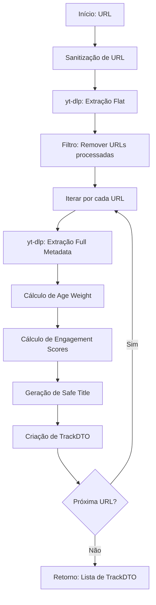

# Fluxograma: PlaylistManager - fetch_entries

```mermaid
graph TD
    A[Início: URL] --> B[Sanitização de URL]
    B --> C[yt-dlp: Extração Flat]
    C --> D[Filtro: Remover URLs processadas]
    D --> E[Iterar por cada URL]
    E --> F[yt-dlp: Extração Full Metadata]
    F --> G[Cálculo de Age Weight]
    G --> H[Cálculo de Engagement Scores]
    H --> I[Geração de Safe Title]
    I --> J[Criação de TrackDTO]
    J --> K{Próxima URL?}
    K -- Sim --> E
    K -- Não --> L[Retorno: Lista de TrackDTO]
```
